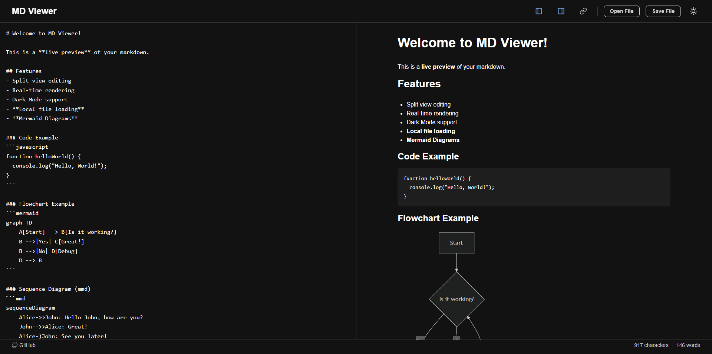

# Markdown Viewer Web App

A modern, responsive, and privacy-focused Markdown viewer and editor built with Vanilla JS and CSS. Features real-time rendering, diagram support, and persistent local storage.

## Demo
https://admirable-panda-5eb48e.netlify.app/

## 📸 Screenshot

*(Place your `screenshot.png` in the root directory)*

## ✨ Features

- **Real-time Rendering**: Instant preview of your Markdown.
- **Split-Pane View**: Adjustable editor and preview panes with toggle controls.
- **Sync Scroll**: Synchronized scrolling between editor and preview.
- **Persistent Storage**: Auto-saves your content to `localStorage` so you never lose work.
- **Rich Content Support**:
  - Full Markdown syntax via `marked.js`
  - Mermaid Diagrams (Flowcharts, Sequence, Gannt, etc.)
  - Syntax highlighting for code blocks
  - Table formatting
- **File Operations**:
  - Open local `.md` files
  - Save/Download as `.md` file
- **Theme System**: Toggable Light/Dark mode with system preference detection.
- **Responsive Design**: Mobile-friendly layout (stacks vertically on small screens).
- **Status Bar**: Real-time character and word counts.

## 🚀 Usage

### Running Locally
1. Clone the repository or download the files.
2. Open `index.html` in any modern web browser.
3. Start writing!

### Hosting
This project is static-site ready. You can deploy it instantly on **GitHub Pages**, Netlify, or Vercel.

## 🛠 Tech Stack

- **HTML5**: Semantic structure.
- **CSS3**: Vanilla CSS with a scalable BEM architecture and CSS Variables (Custom Properties).
- **JavaScript**: Vanilla ES6+ logic.
- **Libraries**:
  - [Marked.js](https://marked.js.org/): For parsing Markdown.
  - [Mermaid.js](https://mermaid.js.org/): For rendering diagrams.

## 📄 License

MIT License. Feel free to use and modify.
