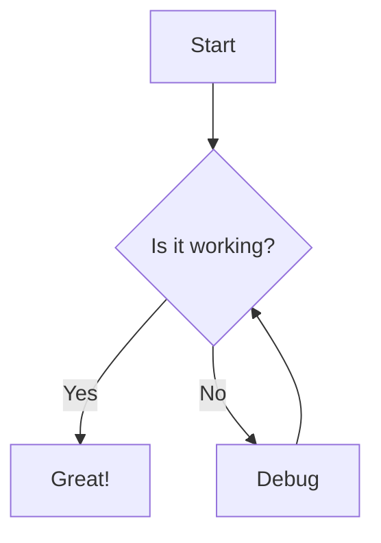

# Welcome to MD Viewer!

This is a **live preview** of your markdown.

## Features
- Split view editing
- Real-time rendering
- Dark Mode support
- **Local file loading**
- **Mermaid Diagrams**

### Code Example
```javascript
function helloWorld() {
  console.log("Hello, World!");
}
```

### Flowchart Example


### Sequence Diagram (mmd)
```mmd
sequenceDiagram
    Alice->>John: Hello John, how are you?
    John-->>Alice: Great!
    Alice-)John: See you later!
```

### Table Example
| Syntax | Description |
| ----------- | ----------- |
| Header | Title |
| Paragraph | Text |

### Lists
1. Item 1
2. Item 2
   - Subitem A
   - Subitem B

> Blockquotes are also supported!
